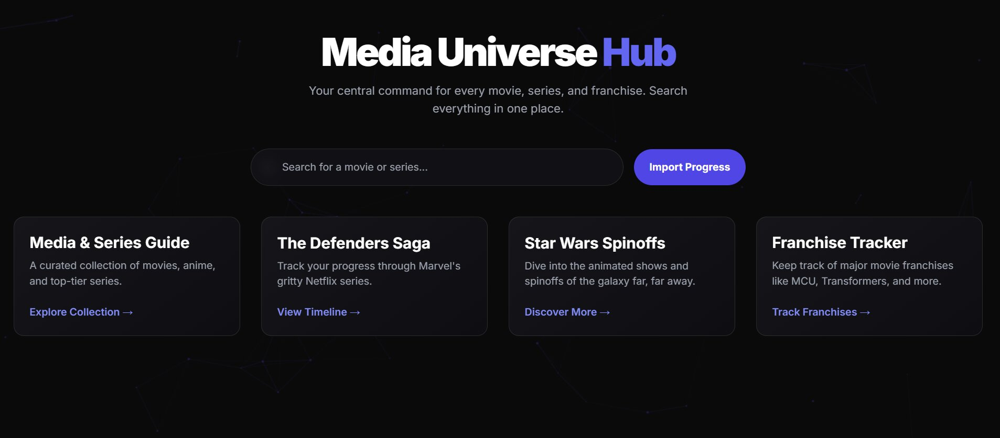

# 🎬 Media Universe Hub

Your personal corner of the cosmos for tracking every movie and series you love. ✨

  

## Welcome, Watcher! 👋

This project is a collection of interconnected watchlists designed to help you keep track of vast media franchises and personal watchlists all in one place. It's built to be fast, beautiful, and entirely yours to control.

## Core Features

* **🔍 Unified Search**: Instantly search across all your collections from a single, lightning-fast search bar.

* **✅ Progress Tracking**: Mark what you've watched and see your progress at a glance.

* **🧭 Seamless Navigation**: A central hub connects you to dedicated trackers for different franchises and collections.

* **💾 Personal Backups**: Easily save and load your progress, ensuring you never lose your place.

* **🎨 Interactive & Beautiful UI**: A clean, modern interface with subtle animations makes tracking your media a pleasure.

This is more than just a list; it's your command center for exploring new worlds and revisiting old favorites. 🚀
